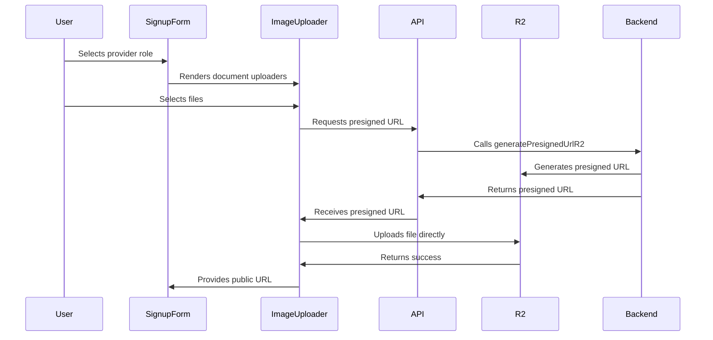

# Identity Image Collection Documentation

This document explains how identity image collection works in the Bali-Listing Sharetribe Flex marketplace application, covering the flow from user upload through to storage in Cloudflare R2.

## Overview

The identity image collection system allows users to upload identification documents during the signup process. These documents are stored securely in Cloudflare R2 storage. The system handles different document types based on user role (individual, freelance, company) and includes both front-end components and back-end API endpoints.

## Key Components

### 1. Frontend Components

#### `SignupForm.js`
The main signup form component that conditionally renders image uploaders based on user type and role:
- For providers, it shows document upload fields
- Renders different `ImageUploader` components based on the selected role:
  - Individual: ID Document (KTP/Driving License/Passport)
  - Freelance: NPWP Document
  - Company: NIB or NPWP mentioning company name
- Also includes a selfie image uploader for verification

#### `ImageUploader.js`
A reusable React component that handles:
- File selection via drag-and-drop or click
- File validation (images/PDFs, max 20MB)
- Progress tracking during upload
- Preview display of uploaded files
- Integration with R2 storage via presigned URLs

### 2. API Utilities

#### `api.js`
Contains the `getPresignedUrlR2` function that:
- Communicates with the backend API to get presigned URLs for R2 uploads
- Handles serialization/deserialization of data using Transit format
- Manages error handling for API requests

### 3. Backend Endpoints

#### `server/apiRouter.js`
Registers the R2 endpoint:
- `/api/r2/generate-presigned-url` - Generates presigned URLs for direct R2 uploads

#### `server/api/R2/index.js`
Implements the presigned URL generation:
- Uses AWS SDK for Cloudflare R2 integration
- Generates PUT presigned URLs for direct client-to-R2 uploads
- Handles file metadata including original name and category

## Upload Flow

### 1. User Interaction
1. User selects "provider" type during signup
2. User selects their role (individual, freelance, company)
3. Relevant document uploader fields appear based on role
4. User drags/drops or clicks to select files

### 2. Frontend Processing
1. `ImageUploader` component receives selected files
2. For each file, it calls `getPresignedUrlR2` to request a presigned URL
3. Backend generates and returns a presigned URL for direct R2 upload
4. Component uploads file directly to R2 using XMLHttpRequest
5. Progress is tracked and displayed to user
6. Public URLs are constructed for successful uploads

### 3. Backend Processing
1. `generatePresignedUrlR2` endpoint receives file metadata
2. Validates required parameters (name, type)
3. Creates a `PutObjectCommand` with appropriate metadata
4. Generates a presigned URL using AWS SDK
5. Returns the URL to the frontend for direct upload

### 4. Storage
1. Files are stored in Cloudflare R2 with the path structure:
   `{storagePath}/{fileName}`
2. Default storage path is 'documents'
3. Metadata including original filename and category is stored

## ImageUploader Component Deep Dive

The `ImageUploader` component is a sophisticated React component that provides a complete solution for uploading images and documents to Cloudflare R2 storage. Here's a detailed breakdown of its functionality:

### Component Props

- `columns` (default: 3) - Number of columns in the image grid layout
- `dropzoneHeight` (default: '15rem') - Height of the dropzone area
- `labelText` (default: 'Profile') - Text label for the profile indicator
- `onProfileChange` (default: noop function) - Callback when the profile image changes
- `maxImages` (default: null) - Maximum number of images allowed (null for unlimited)
- `label` (default: 'label') - Label text displayed above the uploader
- `userId` (default: null) - User ID for R2 storage path (currently not used)
- `storagePath` (default: 'documents') - Path in R2 where files are stored

### State Management

The component maintains several state variables:
- `images` - Array of selected files with preview URLs
- `profileIndex` - Index of the currently selected profile image
- `uploadProgress` - Array tracking upload progress for each file
- `uploadedUrls` - Array of public URLs for successfully uploaded files

### Core Functions

#### `uploadFileToR2(file, progressIndex)`
This async function handles the complete upload process for a single file:
1. Updates progress state to indicate upload start
2. Prepares parameters for the presigned URL request
3. Calls `getPresignedUrlR2` to get a presigned URL from the backend
4. Uses XMLHttpRequest for the actual file upload to enable progress tracking
5. Updates progress state during upload
6. Constructs the public URL upon successful upload
7. Handles various error cases (network errors, upload failures)

#### `onDrop(acceptedFiles)`
The main drop handler that processes files when they're selected:
1. Creates preview URLs for all files using `URL.createObjectURL`
2. Initializes progress tracking for new files
3. Updates the images state to display previews immediately
4. Handles concurrent uploads using Promise.all
5. Updates uploaded URLs state upon completion
6. Calls the `onProfileChange` callback when appropriate

#### `handleProfileChange(index)`
Updates the selected profile image:
1. Sets the new profile index
2. Calls `onProfileChange` with the corresponding URL or file object

#### `handleDelete(index)`
Removes an image from the uploader:
1. Filters out the deleted image from all state arrays
2. Updates the profile index if necessary
3. Calls `onProfileChange` with the new profile image

### UI Features

#### Dropzone
- Uses `react-dropzone` library for drag-and-drop functionality
- Supports both click-to-select and drag-and-drop interactions
- Accepts image files and PDF documents
- Shows different text when drag is active
- Has a customizable height via props

#### Image Grid
- Responsive grid layout based on the `columns` prop
- Each image/file has a delete button (✕)
- Selected profile image is highlighted with a green border
- PDF files show a special preview with "PDF" label and filename
- Images show actual previews using object URLs

#### Progress Tracking
- Real-time upload progress using XMLHttpRequest progress events
- Visual progress bar for each file
- Status indicators (uploading, completed, failed)
- Success checkmark for completed uploads
- Error messaging for failed uploads

#### File Type Handling
- Different display for images vs. PDFs
- Images show actual previews
- PDFs show a placeholder with "PDF" label and filename
- Both support the same interaction and deletion features

### Integration with R2 Storage

The component integrates with Cloudflare R2 through a presigned URL system:
1. Requests a presigned URL from the backend API
2. Uploads directly to R2 using XMLHttpRequest (avoiding server proxy)
3. Constructs public URLs based on environment configuration
4. Tracks upload progress in real-time

### Memory Management

The component properly manages memory by:
- Revoking object URLs when the component unmounts (using useEffect cleanup)
- Cleaning up XMLHttpRequest event listeners

### Error Handling

The component implements comprehensive error handling:
- Network errors during presigned URL requests
- Upload failures to R2
- Invalid file parameters
- Progress tracking errors
- Graceful degradation for failed uploads

## Backend Implementation Details

### R2 Client Configuration
The backend uses AWS SDK to interact with Cloudflare R2:
- Endpoint: `https://${R2_ACCOUNT_ID}.r2.cloudflarestorage.com`
- Region: 'auto'
- Authentication using access key ID and secret access key

### Presigned URL Generation
- Uses `PutObjectCommand` for upload operations
- Sets appropriate content type and metadata
- Includes original filename and file category in metadata
- URLs expire after 30 seconds for security

### File Categorization
Files are categorized based on MIME type:
- Images: image/* types
- Documents: application/pdf
- Others: any other type

## Implementation Details

### File Categories
Files are categorized based on MIME type:
- Images: image/* types
- Documents: application/pdf

### Storage Path Configuration
- Default path: 'documents'
- Can be customized via props to `ImageUploader`
- Files are stored with their original names

### Security Considerations
- Presigned URLs expire after 30 seconds
- Direct uploads from client to R2 avoid proxying through the server
- File type validation on frontend and backend

### Error Handling
- Network errors during upload are caught and displayed
- Failed uploads show error indicators
- Backend errors return appropriate HTTP status codes

## Customization Points

### Modifying Storage Location
1. Change the `storagePath` prop in `ImageUploader` components
2. Modify `R2_BUCKET_NAME` environment variable
3. Update `REACT_APP_R2_PUBLIC_DOMAIN` for public URL construction

### Adding New Document Types
1. Modify role-based filtering in `SignupForm.js`
2. Add new `ImageUploader` components as needed
3. Update backend validation in `server/api/R2/index.js` if needed

## Environment Variables

Required environment variables:
- `R2_BUCKET_NAME`: Cloudflare R2 bucket name
- `R2_ACCOUNT_ID`: Cloudflare account ID for R2 endpoint
- `R2_ACCESS_KEY_ID`: Access key ID for R2 authentication
- `R2_SECRET_ACCESS_KEY`: Secret access key for R2 authentication
- `REACT_APP_R2_PUBLIC_DOMAIN`: Public domain for accessing uploaded files

## Data Flow Summary

## Future Improvements

1. Add server-side validation of uploaded files
2. Implement file size reduction/compression
3. Add support for additional file types
4. Enhance progress tracking with more detailed status
5. Implement file deletion/cleanup mechanisms